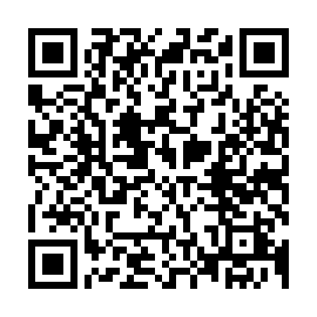

# Gyrovault

A PS Vita homebrew tilt maze. Tilt the console to roll a steel ball through the maze and drop it into the glowing vault hole. Avoid the other holes.

- **20 vaults**, ordered from easy to hardest. Clearing a vault unlocks the next one.
- Tilt-only ball control (motion sensor). No stick or d-pad fallback, so PS TV is not supported.
- Progress saved to `ux0:data/gyrovault/save.dat`. Saves from earlier builds are migrated automatically.
- Built-in updater: *Check for Updates* on the main menu downloads and installs the latest GitHub release.

## Install

1. Download `gyrovault.vpk` from the [latest release](https://github.com/stevenjc2009-byte/gyrovault/releases/latest).
2. Copy it to your Vita and install it with VitaShell.
3. For the built-in updater to install updates, enable **Unsafe Homebrew** in HENkaku Settings.

### Install straight from the Vita (QR code)

Scan this with VitaShell's QR reader. A scanned URL ending in `.vpk` is downloaded and offered for install, so the Vita never needs a PC or a USB cable.



It encodes `https://github.com/stevenjc2009-byte/gyrovault/releases/latest/download/gyrovault.vpk`, which always resolves to the newest release, so this code stays correct after every update.

If VitaShell fails on it — it has [known](https://github.com/TheOfficialFloW/VitaShell/issues/280) [trouble](https://github.com/TheOfficialFloW/VitaShell/issues/414) with GitHub release links — scan it with [Vita VPK Installer Direct](https://github.com/theheroGAC/Vita-VPKInstaller-Direct) instead, which handles the redirect with libcurl. On firmware without TLS 1.2, downloads from GitHub need iTLS-Enso.

## Controls

| Where | Input |
|---|---|
| Menus | D-pad to choose, Cross to select, Circle to go back |
| Level Select | D-pad moves around the 5 × 4 grid; locked vaults can't be picked |
| Playing | Tilt the Vita. START pauses (Resume / Recalibrate / Quit to menu) |

When a vault starts, hold the Vita in your comfortable "level" position for a second. That pose becomes neutral.

## Building (WSL + VitaSDK)

```sh
./build.sh          # release -> build/gyrovault.vpk
./build.sh test     # emulator build -> build-test/gyrovault.vpk (d-pad also tilts, for Vita3K)
```

Needs `$HOME/vitasdk` and CMake 3.16 or newer. LiveArea art is generated by `python3 tools/make_sce_sys.py` (Pillow) as 8-bit indexed PNGs.

Host unit tests: `make -C tests run`. The suites cover physics, levels (all 20 are distinct and solvable, with difficulty rising level by level), save format and migration, version comparison and motion mapping.

## Credits

- The fake-PKG header template in `src/pkg_install.c` is the same header used by VitaShell, VHBB and VitaDB Downloader.
- `assets/cacert.pem` is the Mozilla CA certificate bundle as distributed by curl.

## License

GPL-3.0. See [LICENSE](LICENSE).
